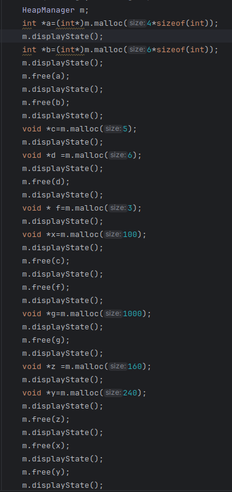
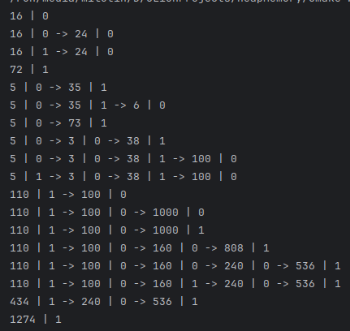

<h1>HeapMemory</h1>

  Custom heap memory manager in modern C++ — a small, educational project that explores how allocators work under the hood (free lists, block splitting/merging, alignment, and allocation strategies).
   
  <em>Built with CMake; C++ sources live in <code>App/</code> and <code>Manager/</code>.</em>

<h2>🔥 Why</h2>
<ul>
  <li>Learn OS/internal concepts hands-on by implementing a heap on top of a raw buffer.</li>
  <li>Experiment with allocation and deallocation behavior.</li>
  <li>Provide a minimal, testable allocator you can instrument and benchmark.</li>
</ul>

<h2>✨ Features</h2>
<ul>
  <li>Fixed-size heap backed by a contiguous buffer (no system <code>malloc</code> needed).</li>
  <li>Simple <code>allocate(size, align)</code> / <code>deallocate(ptr)</code> API surface.</li>
  <li>Block splitting when a request is smaller than a free block.</li>
  <li>Optional block coalescing (merge adjacent free blocks).</li>
  <li>Uses <strong>first-fit allocation strategy</strong> (scans from the beginning of the free list and picks the first suitable block).</li>
</ul>

<h2>📦 Project layout</h2>
<pre><code>HeapMemory/
├─ App/          # small demo / CLI usage examples
├─ Manager/      # heap manager sources (allocator, block metadata, etc.)
├─ Pictures/     # diagrams &amp; notes
├─ CMakeLists.txt
└─ README.md
</code></pre>

<h2>🚀 Quickstart</h2>

<h3>Build</h3>
<pre><code># from repository root
mkdir -p build &amp;&amp; cd build
cmake ..
cmake --build .
</code></pre>

<h3>Run the demo</h3>
<pre><code># After building:
./HeapMemoryDemo            # name may differ based on your CMake target
</code></pre>

<h2>🧭 Usage (example)</h2>
<pre><code class="language-cpp">#include &lt;cstddef&gt;
#include <cstdlib>
#include <iostream>
#include "../Manager/manager.h"
using namespace std;

int main(int argc,char *argv[]){
    HeapManager m;
    int *a=(int*)m.malloc(4*sizeof(int));
    m.displayState();
    int *b=(int*)m.malloc(6*sizeof(int));
    m.displayState();
    m.free(a);
    m.displayState();
    m.free(b);
    m.displayState();
    void *c=m.malloc(5);
    m.displayState();
    void *d =m.malloc(6);
    m.displayState();
    m.free(d);
    m.displayState();
    void * f=m.malloc(3);
    m.displayState();
    void *x=m.malloc(100);
    m.displayState();
    m.free(c);
    m.displayState();
    m.free(f);
    m.displayState();
    void *g=m.malloc(1000);
    m.displayState();
    m.free(g);
    m.displayState();
    void *z =m.malloc(160);
    m.displayState();
    void *y=m.malloc(240);
    m.displayState();
    m.free(z);
    m.displayState();
    m.free(x);
    m.displayState();
    m.free(y);
    m.displayState();
    return 0;
}
</code></pre>

<h2>🖼️ Diagrams &amp; Visuals</h2>

The following examples show how the heap manager allocates and frees memory:

  
   
  <em>Example sequence of allocations and frees using <code>HeapManager</code>, showing calls to <code>malloc</code>, <code>free</code>, and <code>displayState</code>.</em>

  
   
  <em>Console output of <code>displayState</code>, showing the state of the free list, block sizes, and fragmentation after each operation.</em>

<h2>🗺️ Roadmap</h2>
<ul>
  <li>[ ] Add benchmark suite</li>
  <li>[ ] (Future) Add more allocation strategies (best-fit, next-fit) for comparison</li>
</ul>

<h2>📚 Learn more</h2>

This repo is mostly <strong>C++</strong> with some <strong>CMake</strong> for building.

<h2>🤝 Contributing</h2>

PRs and issues are welcome — small improvements (docs, tests, diagrams) are great starts.

<h2>🧾 License</h2>

Choose one (MIT/Apache-2.0) and add a <code>LICENSE</code> file. If you already have a license, reference it here.

